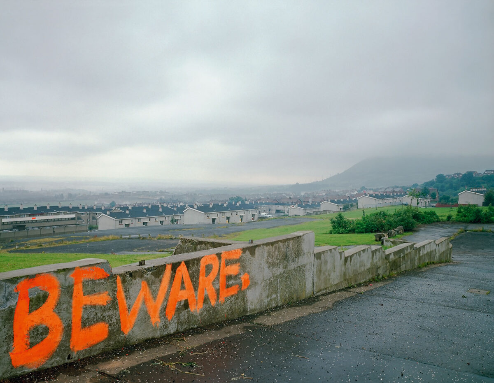

<nav style="text-align: center; padding: 20px 0; border-bottom: 2px solid rgb(122, 6, 97); margin-bottom: 30px;">
  <a href="/" style="margin: 0 15px; color: rgb(122, 6, 97); font-weight: bold;">Home</a>
  <a href="teaching" style="margin: 0 15px; color: rgb(122, 6, 97); font-weight: bold;">Teaching</a>
  <a href="projects" style="margin: 0 15px; color: rgb(122, 6, 97); font-weight: bold;">Projects</a>
</nav>

<small>Paul Graham, ‘Graffiti, Ballysillan Estate, Belfast, 1986’, from <i>Troubled Land</i> (MACK, 2022).</small>

 

## About

I'm a PhD student, teacher, and 'artist' investigating how communities resist cultural and technological colonization. My work asks: Who gets to make meaning and why? How do we democratize this process?

This question animates my research in decolonial aesthetics (focusing on critical intercultural solidarities with Kashmir and Northern Ireland as my focus), my creative practice in generative literature and critical making, and my teaching in composition and digital literacies.

## Research Work

- __Decolonial and postcolonial theory__

    How do occupied communities use visual and digital culture to resist dominant narratives?

- __Algorithmic creativity and democratic technology__

    Who controls the tools that shape language, and how can we build alternatives?

- __Critical making and open-source practice__
    
    What does it mean to create art and scholarship using accessible, non-commercial tools?

## Teaching Work

- How do digital platforms transform what it means to “write”?

- What new literacies emerge in online, interactive, or algorithmic spaces?

- How can we teach writing that prepares students for a post-print world?
