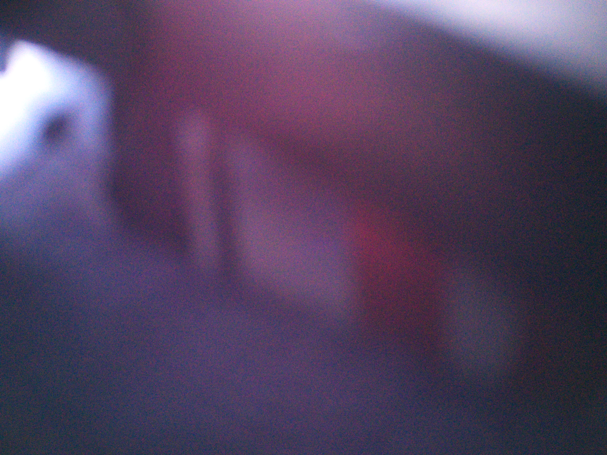

## About

I make poetry, fiction, and physical artifacts with rule-based systems—<a href="/creative/" class="animated-link">Markov chains, cut-up algorithms, constrained generation</a>. These works investigate what happens when we open the black box: treating algorithmic authorship as a transparent, deliberate process rather than corporate "magic." My practice includes generative text devices with thermal printers, conceptual sculpture engaging right-to-repair advocacy, data visualizations pairing political data with grassroots visual culture, and independent publishing through zines and small press.

I'm a PhD student in <a href="https://cah.ucf.edu/textstech/who-we-are/" class="animated-link">Texts & Technology at UCF</a>, where my research examines constraint-based literature and procedural authorship. My scholarly work explores how communities maintain narrative control in contested spaces—particularly through visual culture in Belfast and Kashmir—while my creative practice builds generative tools that make process visible and accessible.

A central question animates both trajectories: How do we democratize who gets to make meaning?

This operates across my creative work (designing open-source generative systems), my research (examining who controls narrative technologies), and my <a href="/teaching/" class="animated-link">teaching</a> (helping first-year composition students navigate what "writing" means inside and outside algorithmic spaces).